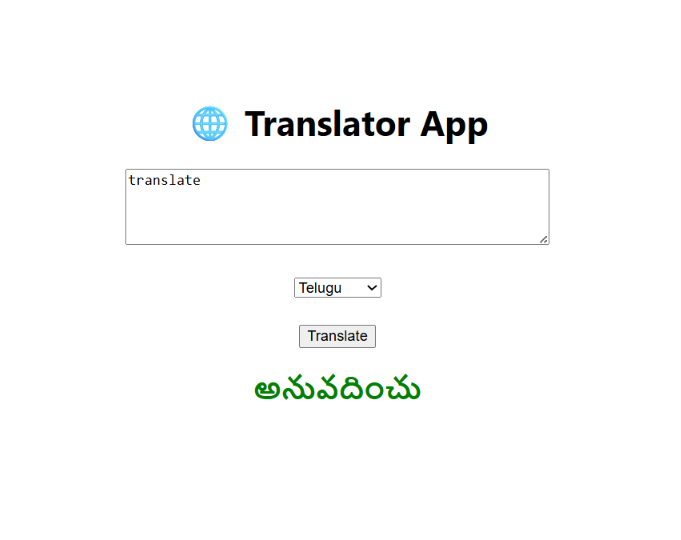
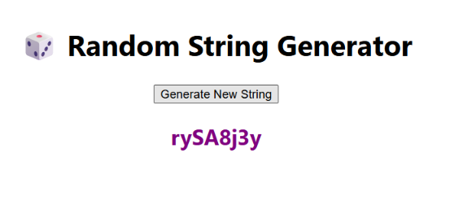
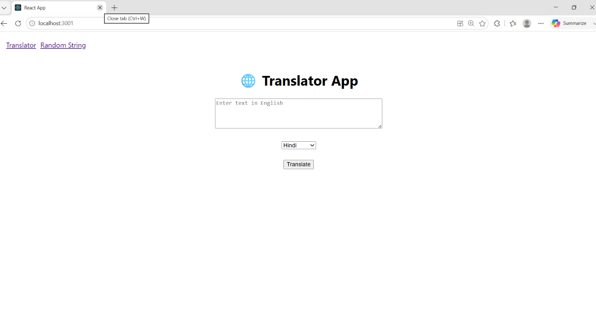

# 🌐 QSkill Internship - Slab 1 Project

A React + Tailwind web application built for the **Qwin Internship (Front-End Development)**.  
This project includes a **Text Translator** using RapidAPI and a **Random String Generator** with React hooks, along with client-side routing.

---

## ✅ Tasks Completed
- Translator App (React + Tailwind + RapidAPI)  
- Random String Generator (React hooks: useState, useCallback, useEffect)  
- Client-side Routing (react-router-dom)  

---

## 🚀 Features
- Translate text from English into your favorite language.  
- Generate random strings with React hooks.  
- Navigate between features using client-side routing.  

---

## 🛠 Tech Stack
- React  
- Tailwind CSS  
- RapidAPI  
- React Router DOM  

---

## 📂 Project Structure
- `src/App.js` → Main app with routing  
- `src/Translator.js` → Translator component  
- `src/RandomString.js` → Random string generator  
- `public/` → Static assets  
- `README.md` → Project documentation  

---

## ⚙️ How to Run
To run this project locally, follow these steps:

```bash
# 1. Clone the repository and navigate to the folder
git clone https://github.com/vyshnavisalluri123-coder/qskill-slab1-project.git
cd qskill-slab1-project

# 2. Install dependencies
npm install

# 3. Start the app
npm start

---
## 📸 Screenshots

### Translator Page


### Random String Generator


### App Home / Routing

---